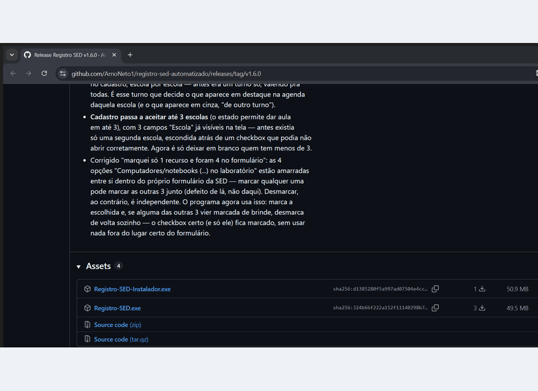

# Registro SED Automatizado

[](https://github.com/ArnoNeto1/registro-sed-automatizado/releases/latest)
[-2f6f4f?style=for-the-badge)](https://github.com/ArnoNeto1/registro-sed-automatizado/releases/latest/download/Registro-SED-Instalador.exe)
[](https://github.com/ArnoNeto1/registro-sed-automatizado/releases/latest/download/Registro-SED.exe)

> Os dois botões acima baixam sempre a versão mais nova, sem precisar
> procurar nada. Na dúvida, escolha o **Instalador**.

## Para que serve

Programa para professores orientadores de tecnologia (Blumenau/SC). Ele lê
a agenda de reservas do laboratório do NTE Blumenau e preenche sozinho o
formulário da SED-SC de "Registro de Atividades dos Professores Orientadores
de Tecnologias Educacionais ou Maker" — economizando o trabalho manual de
copiar os dados da agenda para o formulário, aula por aula.

Cobre os 4 tipos de registro que o formulário oferece: Atividade/Aula com
estudantes, Suporte a outros espaços (instalar/configurar equipamento),
Manutenção de equipamentos e Formação/Reunião — os três últimos nem
precisam de aula marcada na agenda: têm botão próprio, sempre disponível.
E se o laboratório (ou tablet/projetor) foi usado sem reserva na agenda
do NTE, também dá para registrar: é só usar o link "Registrar aula sem
agendamento" embaixo da lista de aulas.

**Ele nunca envia nada sozinho.** Sempre para antes do envio, mostra um
resumo de tudo que vai para a SED, e só manda depois que você clicar em
"Enviar para a SED" e confirmar.

## Veja funcionando



Do download até o formulário pronto para conferir — o programa para aí e
espera você clicar em "Enviar para a SED". Nesta demonstração, os nomes dos
professores da agenda, o e-mail da escola e o campo de senha aparecem
tarjados por privacidade; no seu computador eles aparecem normalmente.

## Como instalar e usar

1. Baixe a versão mais recente na página de
   [**Releases**](https://github.com/ArnoNeto1/registro-sed-automatizado/releases/latest).
   Não precisa instalar Python nem nada — escolha um dos dois arquivos:
   - **`Registro-SED.exe`** — portátil. Coloque numa pasta própria (ex.:
     `Área de Trabalho\Registro SED`) e dê dois cliques para abrir.
   - **`Registro-SED-Instalador.exe`** — instala de verdade, com atalho no
     Menu Iniciar e na Área de Trabalho. Pede senha de administrador uma
     vez, na instalação.
2. Na primeira abertura, preencha a tela de cadastro: escola, seu nome, seu
   CPF e os turnos que você atende.
3. O programa já abre com a agenda do dia carregada e a aula mais recente
   sugerida. Escolha a aula, diga quantos estudantes foram atendidos e
   clique em **"Preencher formulário"**.
4. Confira o resumo (cada campo já é lido de volta da própria página, não é
   só uma promessa) e clique em **"Ver no navegador"** se quiser olhar o
   formulário preenchido com os próprios olhos antes de decidir.
5. Só então clique em **"Enviar para a SED"** e confirme.

Isso cobre uma aula normal de laboratório. Se o que você vai registrar é
suporte/instalação de equipamento, manutenção, ou uma formação/reunião,
use as outras abas em cima da lista de aulas — os campos do formulário se
ajustam sozinhos para o tipo escolhido.

Os dois formatos de instalação (portátil e instalador) se atualizam
sozinhos quando sai versão nova, e compartilham os mesmos dados — dá para
trocar de um para o outro sem perder nada. O arquivo
[**`COMECE AQUI.txt`**](COMECE%20AQUI.txt), aqui no repositório, tem mais
detalhes: como dividir o computador com outro professor do laboratório,
perguntas frequentes.

## Limitações conhecidas

- **Número de estudantes** continua manual — o site de agendamento não
  guarda essa informação.
- **Layout do site do NTE ou do formulário da SED pode mudar** a qualquer
  momento (novas perguntas, novos componentes curriculares), o que pode
  exigir ajuste em `agenda_scraper.py` ou `config.py`.

## Para quem for mexer no código

### Rodando a partir do código-fonte

```bash
git clone https://github.com/ArnoNeto1/registro-sed-automatizado.git
cd registro-sed-automatizado
python -m venv venv
source venv/bin/activate          # Windows: venv\Scripts\activate
pip install -r requirements.txt
python -m playwright install chromium   # só usado se não achar Chrome/Edge na máquina

python app.py   # abre a interface gráfica e cadastra pela tela
```

Também dá para rodar por linha de comando (`python main.py --dry-run`,
sem preencher nada de verdade) — veja `python main.py --help`.

### Estrutura dos arquivos

| Arquivo | O que é |
|---|---|
| `app.py` | Interface gráfica (Tkinter) — o programa do dia a dia. |
| `main.py` | Script de linha de comando (mesma automação, sem janela). |
| `iniciar.py` | Porta de entrada do `.exe` — rede de segurança contra falha antes da tela existir (gera `erro.txt`). |
| `agenda_scraper.py` | Login e leitura do site de agendamento do NTE. |
| `sed_form_filler.py` | Preenchimento do formulário da SED, página por página, com conferência de cada resposta. |
| `config.py` | Dados fixos e mapeamentos (disciplina → componente curricular etc.). |
| `configuracao.py` | Tela de cadastro (nome, escola, CPF, turnos) — substitui a edição manual do `.env`. |
| `caminhos.py` | Onde ficam os arquivos do programa (`.py` vs `.exe`, portátil vs instalado) e qual navegador usar. |
| `atualizador.py` | Autoatualização: consulta `versao.json`, baixa e troca os arquivos/o `.exe`. |
| `escolas.py` | Lista de escolas da CRE Blumenau, como aparecem no formulário da SED. |
| `installer/setup.iss` | Script do instalador Windows (Inno Setup). |
| `.github/workflows/montar-programa.yml` | Gera o `.exe` portátil e o instalador e publica a release, automaticamente. |

Dados do professor (`.env`/cadastro, login do navegador, histórico de
envios) ficam ao lado do executável no modo portátil, ou em
`%ProgramData%\RegistroSED` quando instalado dentro de "Arquivos de
Programas" — ver `caminhos.pasta_de_dados()`.

### Publicando uma versão nova

Aumente o número em `VERSAO.txt`, descreva o que mudou numa seção nova em
`NOVIDADES.md` e dê push na `main` — o GitHub Actions monta o `.exe`
portátil e o instalador, publica os dois numa Release e atualiza
`versao.json` sozinho. Veja `PUBLICAR ATUALIZACAO.txt` para o passo a passo
completo.

## Licença

[MIT](LICENSE).
